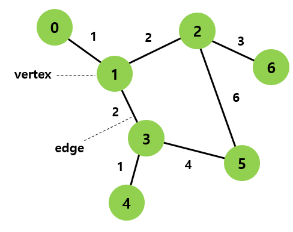
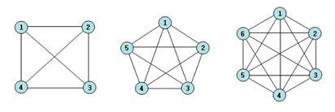
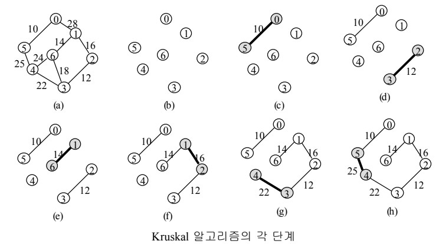

# Graph

## Graph 정의

```
노드와 그 노드를 연결하는 간선을 하나로 모아 놓은 자료 구조
```



---

## Tree와 Graph의 차이

|     |그래프|트리|
|:---:|:----|:----|
|정의|노드(node)와 그 노드를 연결하는 간선(edge)을 하나로 모아 놓은 자료 구조|그래프의 한 종류<br> DAG(Directed Acyclic Graph, 방향성이 있는 비순환 그래프)의 한 종류|
|방향성|방향 그래프(Directed),<br>무방향 그래프(Undirected) 모두 존재|방향 그래프(Directed Graph)|
|사이클|사이클(Cycle) 가능<br>자체 간선(self-loop)도 가능<br>순환 그래프(Cyclic), 비순환 그래프(Acyclic) 모두 존재|사이클(Cycle) 불가능<br>자체 간선(self-loop)도 불가능<br>비순환 그래프(Acyclic Graph)|
|루트 노드|루트 노드의 개념이 없음|한개의 루트 노드만 존재<br>모든 자식 노드는 한 개의 부모 노드만을 가짐|
|부모-자식|부모-자식의 개념이 없음|부모-자식 관계<br>top-bottom 또는 bottom-top으로 이루어짐|
|모델|네트워크 모델|계층 모델|
|순회|DFS, BFS|DFS, BFS안의 Pre-, In-, Post-order|
|간선의 수|그래프에 따라 간선의 수가 다름<br>간선이 없을 수도 있음|노드가 N인 트리는 항상 N-1의 간선을 가짐|
|경로|-|임의의 두 노드 간의 경로는 유일|
|예시 및 종류|지도, 지하철 노선도의 최단 경로, 전기회로의 소자들, 도로(교차점과 일방 통행길), 선수 과목|이진트리, 이진 탐색 트리, 균형트리(AVL트리, red-black트리), 이진 힙(최대힙, 최소힙) 등|

---

## Graph의 방향성


---

## 가중치 Graph


---

## 연결/비연결 Graph


---

## 순환/비순환 Graph


## Complete Graph

```
모든 노드들을 서로 연결하는 간선이 모두 존재하는 그래프
```



---

## Graph 구현


---

## Graph 탐색


---

## Minimum Spanning Tree

```
간선의 가중치의 합이 최소인 tree
```

---

## 최단거리 알고리즘

### Kruskal Algorithm

1. 모든 간선들을 제거
2. 가장 가중치가 낮은 간선부터 검토
3. cycle이 없을 경우 간선을 추가



### Prim Algorithm

1. 각각의 노드들을 한개의 그래프로 분류
2. 두개의 그래프를 연결하는 가중치가 가장 낮은 간선을 추가
3. 모든 그래프들이 한개의 그래프가 될 때까지 2번을 반복


---