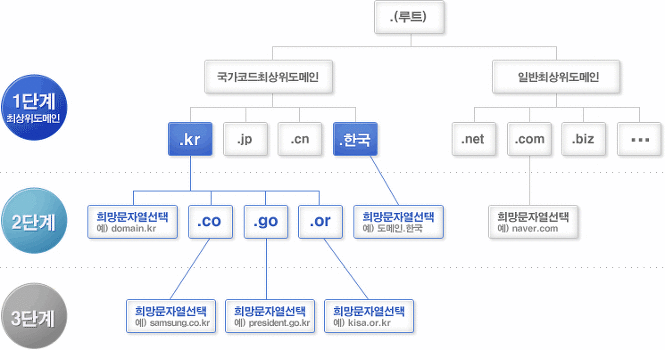
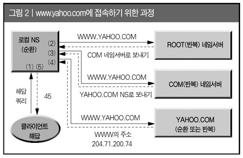

# 웹 통신의 큰 흐름


---

 -  브라우저에서 주소를 검색
 -  URL을 그대로 HTTP Request로 생성
    - DNS서버에서 도메인 주소를 IP주소로 변경
 - 프로토콜 스택(운영체제에 내장된 네트워크 제어 소프트웨어)에서 브라우저의 메시지 수신
 - 수신처 주도 등 제어정보 추가
 - LAN 어댑터에 전송
 - LAN 어댑터에서 다음 Hop의 MAC주소를 추가하여(프레임) 전기신호로 변환
 - 스위칭 허브를 경유하여 인터넷 접속용 라우터에 도착
 - 라우터는 패킷을 프로바이더(통신사)에 전달
 - 인터넷 접속
 - 패킷은 인터넷 입구에서 액세스 회선을 통해 POP(Point Of Presence)로 전송
 - POP를 거쳐 인터넷 핵심부에 접속
 - 수 많은 고속 라우터를 거쳐 목적지로 전송
 - 웹 서버측의 LAN이 패킷 수신
 - 방화벽에서 패킷 검사
    - 웹 서버까지 가지전에 체크를 할 수 있는 캐시서버 존재
 - 웹 서버의 프로토콜 스택이 패킷을 추출하여 웹 서버 어플리케이션에 전달
 - 웹 서버 어플리케이션에서 처리
 - 반대 방향으로 Response 전송

---

## HTTP Protocol

```
프로토콜이란 상호 간에 정의한 규칙을 의미함
```

### HTTP Protocol의 특징

```
HTTP 프로토콜은 상태가 없는(stateless) 프로토콜이다.
여기서 상태가 없다라는 말은 데이터를 주고 받기 위한 각각의 데이터 요청이 서로 독립적으로 관리가 된다는 말이다.
```

---

## DNS 서버


  


 - DNS 탐색 순서(www.google.com)
    1. 클라이언트에서 /etc/resolv.conf에 지정되있는 네임서버로 도메인에 대한 요청 전달
    2. 루트네임서버의 IP를 가지고 있는 `hint 파일`을 이용하여 루트네임서버에 요청
    3. 루트네임서버는 최상위네임서버들의 네임서버명(NS레코드)과 IP주소(A레코드)를 저장해 놓은 글루레코드(glue record)를 확인하여 `.com`네임서버를 참조하라고 응답
    4. `.com`네임서버는 `.com`을 최상위도메인으로 사용하는 도메인들의 글루레코드를 가지고 있어 이를 이용하여 www.google.com의 네임서버를 참조하도록 응답
    5. google.com의 네임서버는 google.com 도메인에 대한 존파일을 참조하여 www.google.com의 IP주소(A레코드)를 클라이언트가 최초 요청한 네인서버에 돌려줌
    6. 최초 요청을 받은 네인서버는 클라이언트에게 www.google.com의 IP주소를 전송