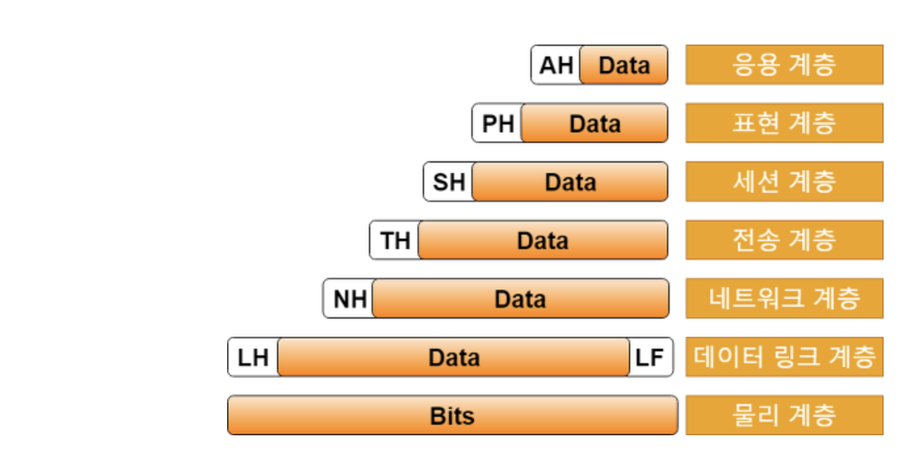
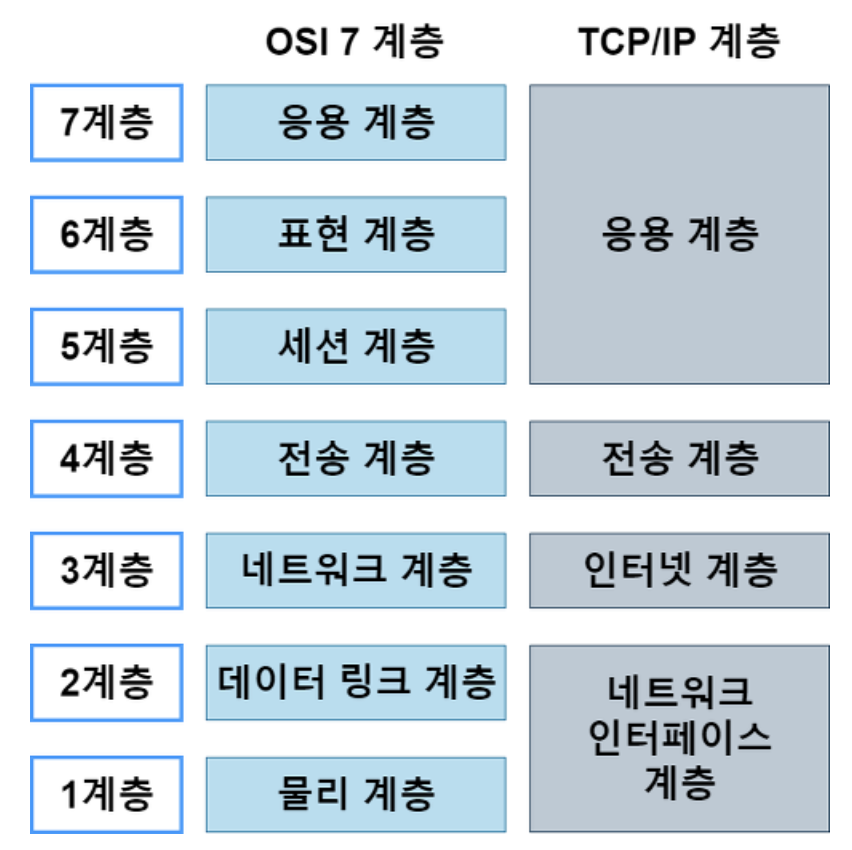
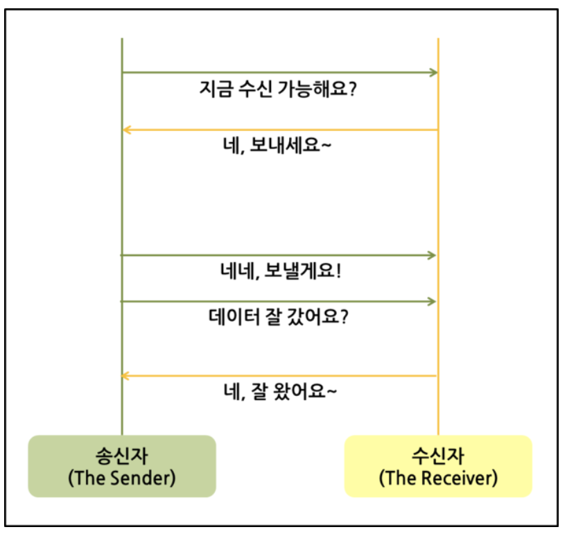
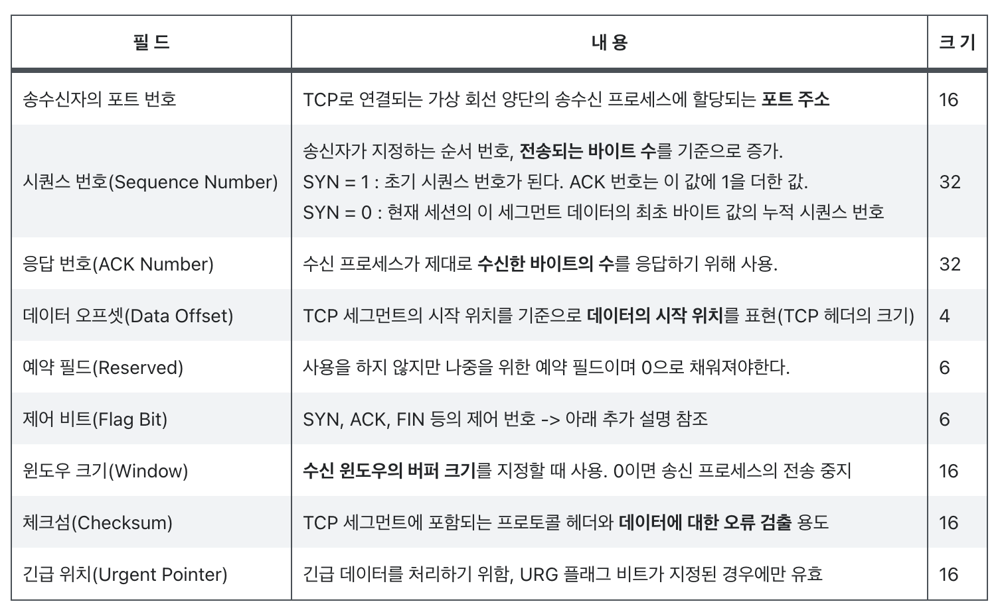
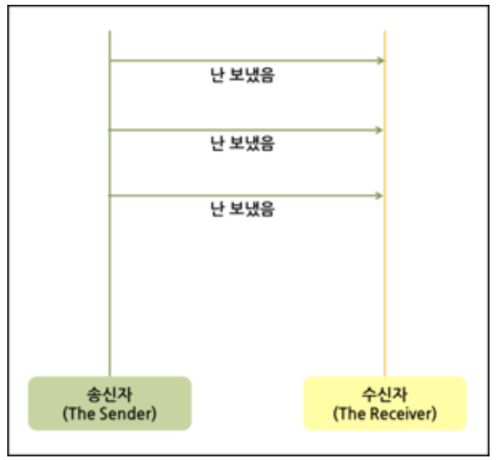
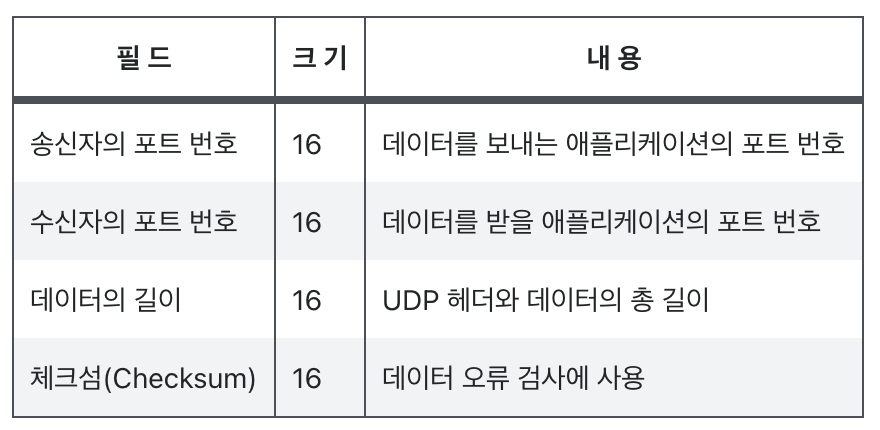
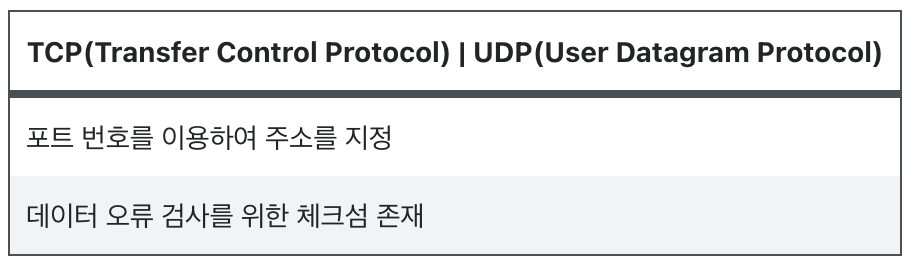
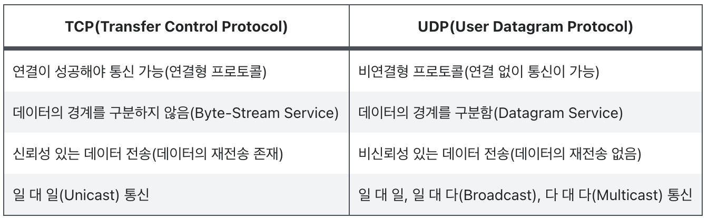

# 📚 TCP vs UDP

## 📕 OSI 7계층 (Open System Interconnection 7 Layer)

OSI 7계층은 국제 표준기구은 ISO(International Standard Organization)으로부터 탄생함. 처음 네트워크 장치는 회사의 장비마다 호환이 되지 않으며 구성이 복잡하여 중구난방이었음. 이에 따라 네트워크를 7계층으로 분리하면서 표준을 만들게 됨 

그림을 보면 위에서부터 차례로 내려오면서 헤더가 붙는 것을 볼수 있음. **각계층에서는 상위 계층의 헤더와 데이터를 데이터로 간주하고 자신의 헤더를 붙여 아래 계층에 전송함(Encapsulation)**. 이런식으로 물리계층까지 가게되면 0과 1의 이진비트가 전송되게 됨. 수신은 반대로 일어남(Decapsulation)

### 1. Physical Layer

* 7계층 중 최하위 계층으로 주로 전기적, 기계적, 기능적인 특성을 이용해 데이터를 전송

### 2. Data-Link Layer
    
* 물리 계층에서 송수신되는 정보의 오류와 흐름을 관리하여 안전한 정보의 전달을 도움
* MAC주소를 가지고있어 통신을 가능하게 함
* 이 계층에서 부르는 데이터의 단위를 프레임(Frame)이라고 함

### 3. Network Layer
    
* 최적의 경로를 설정하여 목적지까지 가장 안전하고 빠르게 데이터를 보내는 아주 중요한 기능(**라우팅(Routing)**)을 함
* IP주소가 이 계층의 헤더에 속해있음
* 네트워크 계층에서 부르는 데이터의 단위를 패킷(Packet)이라고 함
    
### 4. Transport Layer

* 양끝단에 있는 사용자가 신뢰성 있는 데이터를 주고받게 해주는 역할을 함
* 오류검출 및 복구, 흐름제어와 중복검사를 수행
* 데이터 전송을 위해서 Port번호가 사용되는데 대표적인 프로토콜로 TCP와 UDP가 있음
* 이 계층에서 사용되는 데이터단위를 세그먼트(Segment)라고 함

### 5. Session Layer

* 응용 프로세스가 통신을 관리하기 위한 방법 정의

### 6. Presentation Layer

* 데이터를 어떻게 표현할지 정하는 일종의 확장자 역할을 함
    * 응용계층 데이터 부호화, 변화
    * 데이터 압축
    * 데이터 암호화, 복호화

### 7. 응용계층

* 사용자와 가장 가까운 계층
* 사용하는 응용서비스나 프로세스가 이 계층에서 동작

## 📗 TCP/IP 계층 기본 개념

인터넷 프로그램들이 서로 통신하는데 있어 여러 **프로토콜**이 있음. 대표적인 프로토콜로 IP가 있음. TCP/IP는 계층이 아니라 프로토콜이라는 것이 중요함. TCP/IP는 OSI7계층과 조금은 다른 TCP/IP의 구조적인 계층 위에서 동작함



### 1. 네트워크 인터페이스 계층 (Network Interface Layer)

* Node-to-Node간 신뢰성있는 데이터 전송을 담당
* MAC 주소가 사용되고, LAN카드가 동작
* 주요 프로토콜
    * LAN - Ethernet, TokenRing, FDDI 등
    * WAN - X.25, Frame Relay, PPP 등

### 2. 인터넷 계층 (Internet Layer)

* 호스트간 라우팅 담당
* 주요 프로토콜
    * IP(Internet Protocol): 비신뢰성, 비연결지향 프로토콜
    * ARP(Address Resolution Protocol): IP주소를 MAC주소로 변환하는 프로토콜
    * RARP(Reverse ARP): ARP와 반대
    * ICMP(Internet Control Message Protocol): 상태진단 메시지 프로토콜, 대표적인 프로그램이 ping
    * IGMP(Internet Group Message Protocol): 멀티캐스팅용 프로토콜
    
### 3. 전송 계층 (Transport Layer)

* 프로세스간의 신뢰성 있는 데이터 전송을 담당
* process-to-process 전송을 담당하기 위해 논리적 주소(Port 번호)사용
* 주요 프로토콜
    * TCP(Transmission Control Protocol): 신뢰성있는 연결지향형 프로토콜, 복잡한 헤더구조
    * UDP(User Datagram Protocol): 비신뢰성, 비연결형 프로토콜, 간단한 헤더구조

### 4. 응용 계층 (Application Layer)

* 사용자와 가장 가까운 계층
* 서버나 클라이언트 응용프로그램(브라우저, 텔넷등의 서비스)이 동작하고 이를 위해 전송계층의 주소, 즉 포트번호 사용
* 주요 프로토콜
    * HTTP (Hyper-Text Transfer Protocol): TCP기반의 프로토콜로 80번 사용
    * Telnet: TCP포트번호 23번 사용. 원격터미널 접속할때 사용
    * SSH(Secure Shell): 텔넷과 같은 서비스는 보안에취약. 비밀번호가 암호화 되지않기때문. 이것을 보완한 것임. 22번 사용
    * FTP(File Transfer Protocol): 파일전송 프로토콜. 파일을 받거나 올릴때 FTP를 사용. 신뢰성을 중요하게 생각하기 때문에 TCP사용. 포트는 20번-데이터전송용, 21번-제어용으로 사용
    * POP3(Post Office Protocol Version3): 메일 수신용 프로토콜. 아웃룩같은 프로그램이 POP3라는 프로토콜을 사용하여 동작. TCP 포트 110번 사용
    * DNS(Domain Name System): 도메인명에 대한 호스트 정보를 제공. UDP상에서 동작. 신뢰성을 요할 경우 또는 데이터의 길이기 길경우에는 TCP상에서도 동작. UDP, TCP 포트 53번 사용 

-> 위와같이 특정 프로토콜이 사용해서 우리가 쓸수없는 포트를 well-known port라고 함

## 📘 TCP (Transmission Control Protocol)

IP에 의해 전달되는 패킷의 오류를 검사하고 재전송 요구등의 제어를 담당하는 계층인 전송계층에서 사용되는 프로토콜



### 1. 특징

* 연결형 서비스로 가상 회선 방식을 제공
    * 3-way handshaking 과정을 통해 연결을 설정
    * 4-way handshaking 을 통해 연결을 해제

* 흐름제어 (Flow control)
    * 데이터 처리속도를 조절하여 수신자의 버퍼 오버플로우를 방지
        * 송신하는 곳이 감당 안되게 많은 데이터를 빠르게 보내 수신하는 곳에서 문제가 일어나는 것을 방지

* 혼잡제어 (Congestion control)
    * 네트워크 내의 패킷 수가 넘치게 증가하지 않도록 방지
        * 정보의 소통량이 과다하면 패킷을 조금만 전송하여 혼잡 붕괴 현상이 일어나는 것을 막음

* 신뢰성 높은 전송 (reliable transmission)
    * Dupack-based retransmission
        * 정상적인 상황에서는 **ACK** 값이 연속적으로 전송되어야함
        * **ACK**값이 중복으로 올 경우 패킷 이상을 감지하고 재전송을 요청
    * Timeout-based retransmission
        * 일정시간동안 **ACK**값을 수신하지 못할 경우 재전송 요청

* 전이중, 점대점 방식
    * 전이중 (Full-Duplex) -> 전송이 양방향으로 동시에 일어날 수 있음
    * 점대점 (Point ti Point) -> 각 연결이 정확히 2개의 종단점을 가짐

* 멀티캐스팅이나 브로드캐스팅을 지원하지 않음

### 2. Header
응용 계층으로부터 데이터를 받은 TCP는 `헤더`를 추가한 후 이를 IP로 보냄. 헤더에는 아래 표와 같은 정보가 포함됨



## 📗 UDP (User Datagram Protocol)



### 1. 특징

* 수신자가 데이터를 받는지 마는지 관심 없음

* 신뢰성을 보장해 주지않지만 간단하고 속도가 빠름

### 2. Header



## ⚖️ TCP vs UDP

### 1. 공통점



### 2. 차이점



## ⚙️ Referece
* [TCP 와 UDP 차이를 자세히 알아보자](https://velog.io/@hidaehyunlee/TCP-%EC%99%80-UDP-%EC%9D%98-%EC%B0%A8%EC%9D%B4)
* [MyCloud](https://swalloow.tistory.com/77)
* [기타 TCP / UDP의 개념과 특징, 차이점](https://coding-factory.tistory.com/614)
* [TCP와 UDP 차이 그리고 TCP/IP](https://madplay.github.io/post/network-tcp-udp-tcpip)
* [TCP와 UDP의 차이 - livlikwav 개발 블로그](https://livlikwav.github.io/study/tcp-and-udp/)
* [OSI-7 기본개념, 각 계층 설명](https://reakwon.tistory.com/59?category=300675)
