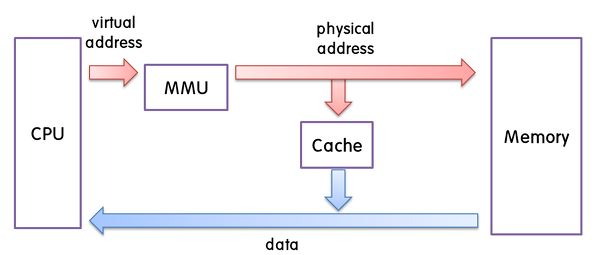
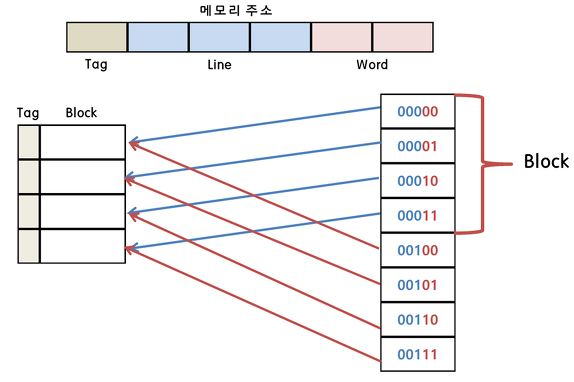
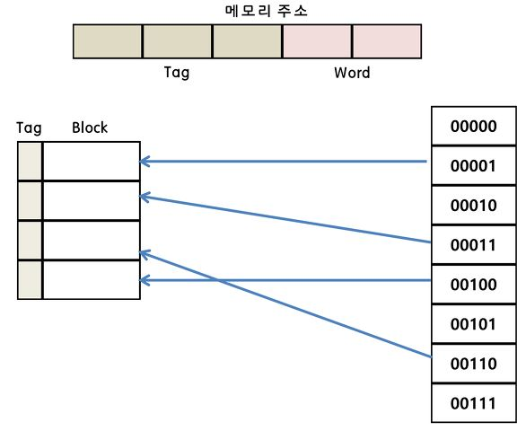
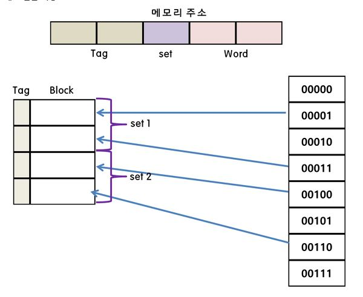

# Cache and Locality

## cache 란
```
캐시 메모리는 CPU의 처리속도와 주기억장치의 접근속도 차이를 줄이기 위해 사용하는 고속 buffer memory이다.
```



## cache memory의 특징

 - cache memory는 메모리 계층 구조에서 가장 빠른 소자이며, CPU의 속도와 비슷한 정도의 속도를 가지고 있다.
 - cache memory를 사용하면 주기억장치에 접근하는 횟수가 줄어들어 작업이 빨라진다.
 - cache의 크기는 수십에서 수백 Kbytes이다.

## cache memory의 매핑 프로세스

 - 직접 매핑 (Direct Mapping)
    - 주기억장치의 블록들이 지정된 한 개의 캐시라인으로만 사상될 수 있는 매핑 방법이다.
    - 간단하고 구현하는 비용이 적게드는 장점이 있지만 적중률이 낮아질 수 있다는 단점이 있다.



 - 어소시에이티브 매핑 (Associative Mapping)
    - 직접 매핑 방식의 단점을 보완한 방식이다.
    - 모든 태그들을 병렬로 검사하기 때문에 복잡하고 비용이 높다는 단점이 있어 거의 사용하지 않는다.



 - 세트-어소시에이티브 매핑 (Set-Associative)
    - 직접 매핑과 연관 매핑의 장점을 취한 방식이다.



# Locality

```C
int a[100][100];

for (i = 0;i < 100;i++)
{
    for (j = 0;j < 100;j++)
    {
        a[i][j] = 10;
    }
}
```

```C
int a[100][100];

for (i = 0;i < 100;i++)
{
    for (j = 0;j < 100;j++)
    {
        a[j][i] = 10;
    }
}
```

어느 코드가 빠를까?

## Locality 란

```
기억 장치 내의 정보를 균일하게 접근하는 것이 아닌 어느 한순간에 특정 부분을 집중적으로 참조하는 특성
```

## Locality의 종류

- Temporal locality
    - 최근 사용되었던 기억 장소들이 집중적으로 엑세스 되는 경향
    - 프로그램 실행시 한번 접근이 이루어진 주소의 메모리 영역은 자주 접하게 된다는 프로그램의 성격 표현
    - ex) 순환, Sub program, Stack, etc
- Spatical locality
    - 특정 클러스터의 기억 장소들에 대해 참조가 집중적으로 이루어지는 경향
    - 프로그램 실행시 접근하는 메모리의 영역은 이미 접근이 이루어진 영역의 근처일 확률이 높다는 프로그램 성격 표현
    - ex) Sequential processing, Array, etc