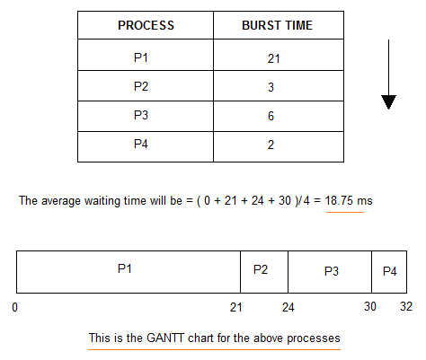
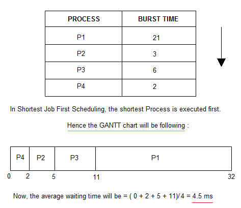
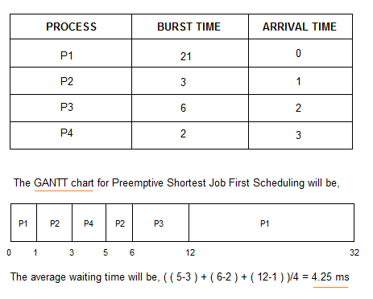
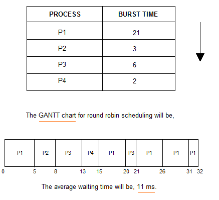

# CPU Scheduler

## CPU Scheduler란

```
레디 큐에 존재하는 프로세스들을 특정한 우선순위를 기반으로 CPU를 할당받게 해주는 역활
```

 - 스케줄링의 목표
    - CPU활용 최대화
    - 평균 대기 시간 최소화
    - 처리량 최대화

## FCFS (First Come, First Served)

```
선입선출 방식의 비선점형 방식

비선점형 : 이미 할당된 CPU는 해당 프로세스가 완료될 때까지 다른 프로세스가 강제로 뺏지 못함
```



 - 장점
    - 가장 공평한 방식
    - 프로세스의 개수, 작업시간을 알면 실행 시간 예측 가능
 - 단점
    - 평균 대기시간이 길어짐(Convoy Effect)
    - 중요한 작업이 중요하지 않는 작업을, 짧은 작업이 긴 작업을 기다림

---

## SJF (Shortest Job First)

```
실행시간이 가장 짧은 프로세스가 먼저 CPU를 할당 받는 스케줄링 방법
```



 - 장점
    - 평균 대기시간이 짧음
 - 단점
    - 실행시간이 긴 프로세스는 레디 큐에 무한정 기다림 (Starvation Effect)
    - 공평성이 떨어짐
    - 입출력이 빈번한 프로세스의 경우 운영체제가 실행시간을 정확히 알기 어려움

---

## SRT (Shortest Remaining Time)

```
현재 실행 중인 프로세스의 남은 시간과 대기 큐에 프로세스의 실행시간이 가장 짧은 프로세스에게 CPU를 할당하는 기법
```



 - 장점
    - 공평한 스케줄링 기법
    - 평균 대기시간을 줄여줌
 - 단점
    - 잦은 문맥 교환으로 인한 오버헤드
    - Starvation Effect

---

## Priority Scheduling

```
우선순위가 높은 프로세스를 먼저 처리
Starvation Effect를 막기위해 Aging기법 사용

Aging기법 : 프로세스가 기다린 시간에 비례하게 우선순위를 올려 너무 오래 기다리게 될 경우 우선순위가 낮아도 CPU를 할당 받게하는 기법
```

 - 장점
    - 중요한 작업들이 먼저 되어 사용자에게 불편이 없음
 - 단점
    - 구현이 복잡함
    - 공평성이 떨어짐

---

## RR (Round Robin)

```
CPU 할당시간(Quantum)을 부여하여 이 시간 동안만 CPU 사용
해당 프로세스가 한 퀀텀동안 작업을 처리하지 못하면 대기 큐의 마지막으로 돌아감
CPU 할당 순서는 FCFS와 동일
```



 - 장점
    - 공평한 스케줄링 기법
    - 모든 프로세스의 대기시간이 줄어듬
 - 단점
    - 퀀텀이 너무 크면 FCFS와 같고 퀀텀이 작으면 문맥 교환이 잦음
