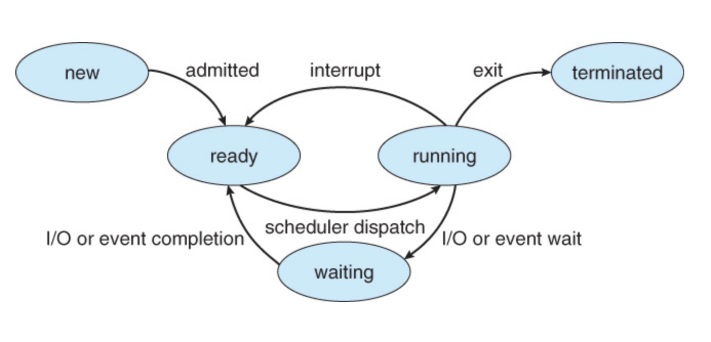
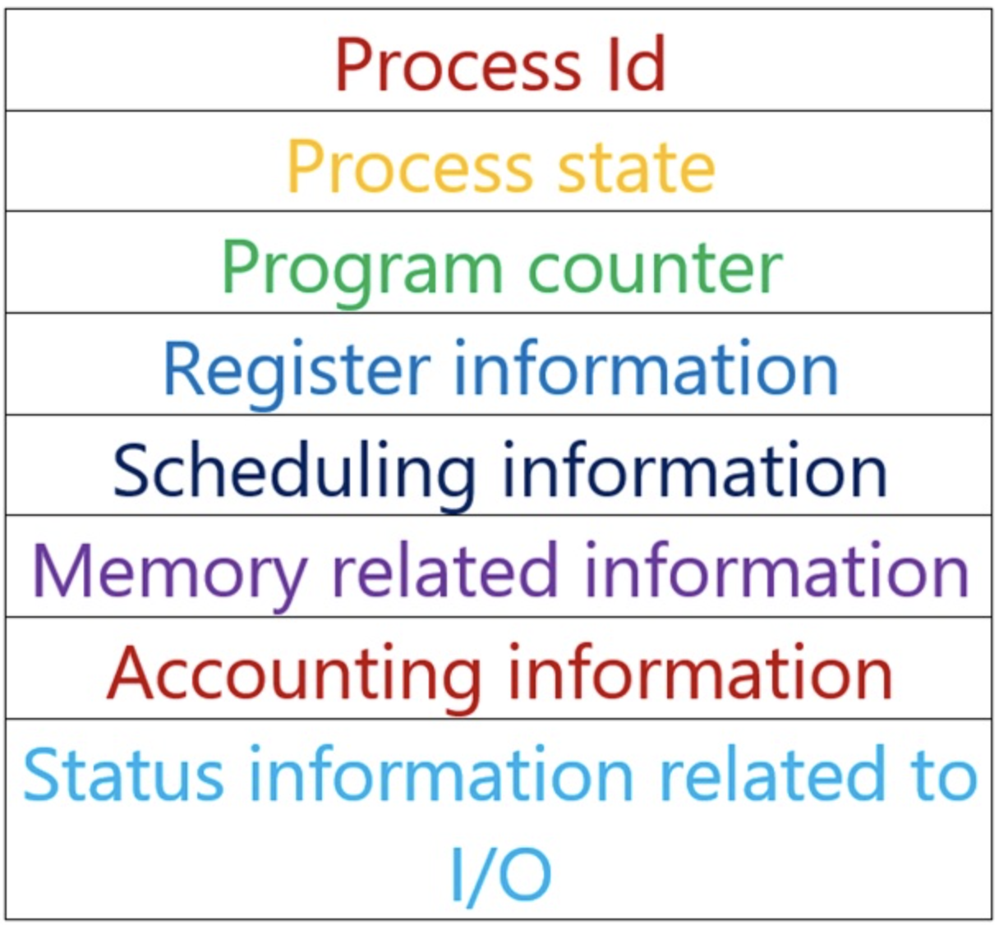
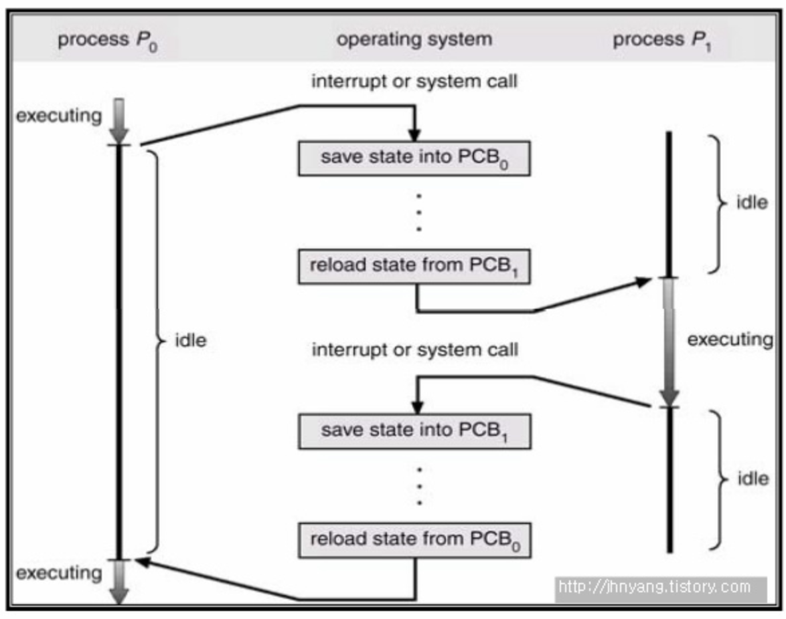
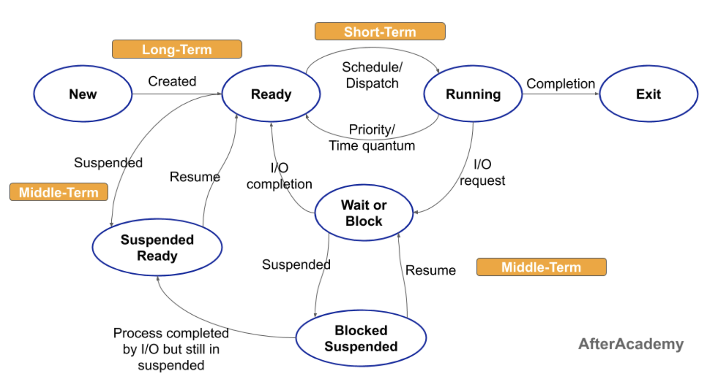

# Scheduler의 종류
## Prior Knowledge
### Process Status Diagram
- - - -

* 프로세스는 실행되면서 그 상태가 변함.
* 프로세스는 부분적으로 그 프로세스의 현재의 활동에 따라서 정의됨
* 프로세스는 다음 상태중 하나에 있게 됨
	1. New -> 프로세스가 생성중
	2. Ready -> 프로세스가 **처리기**에 할당되기를 기다림
	3. Running -> 프로세스에 속한 명령어들이 실행되는중 (Process가 CPU에서 수행됨)
	4. Waiting(Blocked) -> 프로세스가 스스로 수행이 안되서 이벤트(입출력 완료 or 신호의 수신)가 발생되기를 기다림
	5. Terminate -> 프로세스의 실행이 종료됨

### PCB (Process Control Block) -  프로세스 제어 블록
- - - -
#### PCB란?
* 운영체제가 프로세스를 제어하기 위해 정보를 저장해 놓는 곳으로, 프로세스의 상태 정보를 저장하는 구조체
* 프로세스 상태관리와 **문맥교환(Context Switching)**을 위해 필요함
* PCB는 프로세스 생성 시 만들어 지며 **주기억장치**에 유지됨

#### PCB의 구조

* PID (Process ID) ->  프로세스의 고유 번호
* Process status ->  준비, 대기, 실행 등 프로세스의 상태 
* Program counter -> 다음 실행될 명령어의 주소를 가리키는 포인터
* Register information -> 레지스터(?) 관련정보 -> Program counter와 마찬가지로 다시 스케줄 될때 계속 올바르게 실행되기 위하여 저장되어야 함
* Scheduling information -> 프로세스 우선순위, 스케줄 큐에 대한 포인터와 다른 스케줄 매개변수들을 포함
* Memory related information -> 운영체제에 의해 사용되는 메모리 시스템에 따라 기준(base) 레지스터와 한계(limit) 레지스터값, 페이지 테이블 또는 세그먼트 테이블 등과 같은 정보 포함
* Accounting information -> CPU 사용 시간, 실제 사용된 시간
* Status information related to I/O -> 프로세스에 할당된 입출력 장치들과 열린 파일의 목록 등을 포함

### 문맥 교환 (Context Switching)
- - - -
#### 문맥 교환이란?
**CPU가 이전의 프로세스 상태를 PCB에 보관하고, 또 다른 프로세스 정보를 PCB에서 읽어 레지스터에 적재하는 과정을 말함**

* CPU 안에는 프로그램 카운터, 스택 포인터 등의 레지스터가 포함되어 있음
* 따라서 이런 레지스터들이 CPU 자체에 있으니 수행 중인 (running 상태) 프로세스 정보는 CPU 내부, 즉 레지스터들이 저장하고 있음
* 실행중이던 프로세스가 wating 상태가 되면 운영체제가 다른 ready중인 프로세스를 running으로 바꿔 올림
* 다시말해, 원래 실행중이던 프로세스를 PCB에 저장한 후 다른 PCB에서 ready중인 프로세스를 CPU에 올림

#### 문맥교환의 Overhead
* Overhead -> 과부하, 부하, 수수료 정도의 의미
* 문맥교환의 Overhead -> 문맥교환이 일어날때 PCB에 기존 프로세스를 저장하고 다른 PCB에서 새로운 프로세스를 가져오는 과정에서 idle이 발생
* 그럼에도 불구하고 문맥교환을 하는 이유는 waiting 상태에 들어간 프로세스를 처리한후 다음 프로세스를 처리하는 것보다 문맥교환을 통해 대기시간을 줄이는 것이 전체적으로 봤을땐 더 이익이기 때문 -> **운영체제가 CPU를 관리하는 이유**

## Scheduler
### Scheduler란?
- - - -
-> 어떤 프로세스에게 자원을 할당할지를 결정하는 **운영체제 커널**의 모듈을 지칭
> 1. 운영체제(OS)   
> 	-> 컴퓨터 시스템의 자원들을 효율적으로 관리하며, 사용자가 컴퓨터를 편리하고, 효과적으로 사용할 수 있도록 				환경을 제공하는 **여러 프로그램의 모임**   
> 	-> 컴퓨터 사용자와 컴퓨터 하드웨어 간의 인터페이스로서 동작하는 시스템 소프트웨어의 일종  
> 	-> 다른 프로그램들이 유용한 작업을 할 수 있도록 환경을 제공  
> 	-> 운영체제는 무료로 배포해야된다는게 불문율이었지만 이것을 깬 회사가 MS -> ~신병철 피셜~  
> 2. 커널(kernel)  
> 	-> 운영체제 자체도 소프트웨어이기 때문에 전원이 켜짐과 동시에 메모리에 올라가야함  
> 	-> 하지만 이처럼 규모가 큰 프로그램이 모두 메모리에 올라간다면 한정된 메모리 공간의 낭비가 심할 것  
> 	-> 따라서 운영체제중 **가장 필요한 부분**만을 전원이 켜짐과 동시에 메모리에 올려놓고 그렇지 않은 부분은 필요할때 		메모리에 올려 작업  
> 	-> 이때 **메모리에 상주하는 운영체제의 부분을 커널**이라 함 -> 좁은 의미의 운영체제  
> 	-> 즉 커널은 메모리에 상주하는 부분으로써 운영체제의 핵심적인 부분을 뜻함  

### 스케줄러(Scheduler)의 종류
- - - -

#### 1. 장기 스케줄러
* 프로세스 상태의 New -> Ready 와 Running(or Ready) -> Terminated 일때를 관리
* 즉 메모리(주 기억장치)와 디스크(보조 기억장치) 사이의 스케줄링을 담당
* 다른 스케줄러와 비교하여 상대적으로 호출되는 빈도가 작음
> 1. 주 기억장치  
> 	-> CPU가 직접 접근하여 처리할 수 있는 고속의 기억장치(Memory)로 현재 수행되는 프로그램과 데이터를 저장하고 있음  
> 	-> 종류에는 ROM(Read Only Memory), RAM(Random Access Memory)이 있음  
> 2. 보조 기억장치  
> 	-> 2차 기억장치 or 외부기억장치 라고도 불림  
> 	-> 주 기억장치의 단점을 보완하기 위한 기억장치  
> 	-> 보조기억장치는 주 기억 장치에 비해 속도는 느리지만 전원이 차단되어도 내용이 유지되고 저장용량이 큼  

#### 2. 중기 스케줄러
* 메모리에 적재된 프로세스 수 관리
* CPU를 차지하기 위한 경쟁이 심해질 때, 우선순위가 낮은 프로세스들을 잠시 디스크에 저장한 후, 나중에 경쟁이 완화됬을 때 다시 디스크에서 메모리로 불러와 중단되었던 부분부터 다시 실행시켜주는 역할 담당
* 이때 저장하는 디스크의 영역을 **스왑영역** 이라 하며 스왑영역에 저장하는 행위를 스왑아웃(Swap out)이라 함
* 중기 스케줄러의 등장으로 프로세스의 상태에는 중지(Suspenden, Stopped) 상태가 추가되었으며 중지 상태의 프로세스는 메모리를 통째로 빼앗기고 디스크로 스왑 아웃
* 중지 상태는 Suspenden Ready와 Suspenden Block이 있음
	1. Suspenden Ready -> 준비 상태의 프로세스가 중기 스케줄러에 의해 디스크로 Swap out
	2. Suspenden Block -> 봉쇄 상태의 프로세스가 중기 스케줄러에 의해 디스크로 Swap out

#### 3. 단기 스케줄러
* 프로세스 상태의 Ready -> Running -> Waiting -> Ready의 주기를 관리
* CPU와 메모리 사이의 스케줄링을 담당
* 다른 스케줄러와 비교하여 상대적으로 호출빈도가 큼

## Reference
* 운영체제(Operating System Concepts) 10th Edition
* https://jhnyang.tistory.com/
* https://jhnyang.tistory.com/33
* https://www.includehelp.com/operating-systems/process-control-block-in-operating-system.aspx
* https://goodmilktea.tistory.com/23
* https://twinw.tistory.com/4
* https://afteracademy.com/blog/what-is-long-term-short-term-and-medium-term-scheduler
* https://coding-factory.tistory.com/355#:~:text=%EC%A3%BC%EA%B8%B0%EC%96%B5%EC%9E%A5%EC%B9%98%EB%9E%80%3F,%EB%9E%A8(RAM)%EC%9D%B4%20%EC%9E%88%EC%8A%B5%EB%8B%88%EB%8B%A4.

